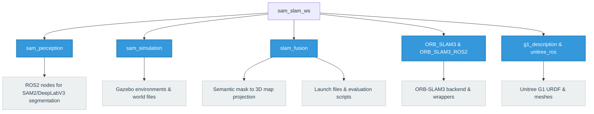

# Subgroup I1: SAM‑Enhanced 3D Semantic SLAM

## About the Project & Problem Solved
Traditional SLAM (Simultaneous Localization and Mapping) systems excel at creating geometric maps of an environment but lack semantic understanding. This restricts robots from performing high-level tasks such as finding specific objects or understanding scene context.

This project solves this problem by integrating foundation model segmentation (SAM2) and classical semantic segmentation (DeepLabV3) into real-time 3D SLAM pipelines. By fusing 2D segmentation masks with 3D SLAM point clouds, the system produces **semantically labeled 3D maps**. This allows us to benchmark and evaluate which SLAM architecture best supports foundation-model-based semantic integration in terms of geometric accuracy, semantic consistency, and real-time performance.

## Algorithms Used & Comparison

### 1. Perception Algorithms
| Feature | SAM2 (Segment Anything Model 2) | DeepLabV3 |
|---------|--------------------------------|-----------|
| **Architecture** | Vision Transformer (Foundation Model) | Classical Convolutional Neural Network (ASPP) |
| **Generalization** | **Zero-shot:** Segments unknown objects without retraining. | **Supervised:** Limited to specific trained classes. |
| **Performance** | Computationally heavy (lower FPS, higher latency). | Faster inference, suitable for strict real-time constraints. |

### 2. SLAM Backends
| SLAM Algorithm | Primary Sensor | Mechanism | Strengths | Weaknesses |
|----------------|----------------|-----------|-----------|------------|
| **ORB-SLAM3** | RGB Camera | Visual feature tracking (FAST/ORB) + Bundle Adjustment | Highly accurate in texture-rich areas; great loop closure (DBoW2). | Drifts or fails in featureless environments (e.g., blank walls). |
| **RTAB-Map** | RGB-D Camera | Visual Odometry + Graph Optimization with Memory Management | Natively generates dense point clouds; highly robust indoors. | Sensitive to depth sensor noise (e.g., IR interference). |
| **Cartographer**| 3D LiDAR | Scan-to-submap matching (Ceres) + Pose Graph Optimization | Extremely robust structural mapping; independent of lighting. | Requires complex synchronization to fuse with RGB semantic masks. |

**Evaluation Metrics:** 
The algorithms are evaluated using `evo` for **Absolute Trajectory Error (ATE)** (global geometric consistency) and **Relative Pose Error (RPE)** (local drift and semantic mask alignment), alongside real-time metrics (latency, FPS).
## Project Structure


## How to Run for Each Algorithm
You can run each SLAM algorithm by specifying the `run_mode` and `perception_model`. 

To run **ORB-SLAM3**:
```bash
ros2 launch slam_fusion eval_orbslam3.launch.py run_mode:=simulation perception_model:=sam2
```

To run **Cartographer**:
```bash
ros2 launch slam_fusion eval_cartographer.launch.py run_mode:=simulation perception_model:=sam2
```

To run **RTAB-Map**:
```bash
ros2 launch slam_fusion eval_rtabmap.launch.py run_mode:=simulation perception_model:=sam2
```
*(Note: You can change `perception_model:=sam2` to `perception_model:=deeplabv3` to test the classical baseline. Additionally, you can change `run_mode:=simulation` to `run_mode:=dataset` to run with datasets instead of the Gazebo simulation).*

## Running the Error Calculation
Once a simulation is finished, trajectories are saved to evaluate the geometric accuracy. You can use the provided bash script to calculate the Absolute Trajectory Error (ATE) and Relative Pose Error (RPE) using `evo`.

```bash
cd src/slam_fusion/scripts
./evaluate_trajectory.sh <estimated_trajectory_file> <groundtruth_file>
```
**Example:**
```bash
./evaluate_trajectory.sh /ros2_ws/orbslam3_sam2_estimate.txt /ros2_ws/gazebo_groundtruth.txt
```

## Quantitative Results & Algorithm Comparison (Gazebo Simulation)

The following metrics represent the Absolute Pose Error (APE) and Relative Pose Error (RPE) Root Mean Square Error (RMSE) in meters.

### 1. Cartographer (2D LIDAR SLAM)
Cartographer relies primarily on 2D LIDAR (`/scan`) rather than visual features, making it highly robust in simulation environments lacking rich visual textures.

| Perception Model | APE RMSE (m) | RPE RMSE (m) |
| :--- | :--- | :--- |
| **SAM2** | 0.139 | 0.048 |
| **DeepLabV3** | 0.019 | 0.020 |

**Cartographer + SAM2 Trajectory Plot**


**Cartographer + DeepLabV3 Trajectory Plot**


---

### 2. ORB-SLAM3 (Visual SLAM)
ORB-SLAM3 relies exclusively on camera data. In textureless simulation environments, visual tracking can struggle, making semantic masks critical for filtering dynamic or featureless zones.

| Perception Model | APE RMSE (m) | RPE RMSE (m) |
| :--- | :--- | :--- |
| **SAM2** | 0.921 | 0.688 |
| **DeepLabV3** | 0.446 | 0.162 |

**ORB-SLAM3 + SAM2 Trajectory Plot**


**ORB-SLAM3 + DeepLabV3 Trajectory Plot**


---

### 3. RTAB-Map (RGB-D SLAM)
RTAB-Map fuses RGB-D visual odometry with loop closure detection. Like ORB-SLAM3, it relies heavily on visual features, making performance sensitive to the segmentation mask quality.

| Perception Model | APE RMSE (m) | RPE RMSE (m) |
| :--- | :--- | :--- |
| **SAM2** | 1.350 | 1.845 |
| **DeepLabV3** | 0.783 | 1.275 |

**RTAB-Map + SAM2 Trajectory Plot**


**RTAB-Map + DeepLabV3 Trajectory Plot**


## Analysis & Conclusion
1. **LIDAR vs Visual SLAM:** **Cartographer** drastically outperformed both visual SLAM algorithms in the Gazebo environment. Because Gazebo walls often lack sufficient texture for robust visual feature extraction, the LIDAR scanner provided a massive advantage.
2. **DeepLabV3 vs SAM2:** Interestingly, across both visual SLAM algorithms, **DeepLabV3** resulted in lower drift (better RMSE) than SAM2. This likely indicates that DeepLabV3's segmentation boundaries masked out confusing visual artifacts more effectively, or SAM2's high-resolution zero-shot masks were too aggressive and masked out viable tracking features. 
3. **Robustness:** Because Cartographer ignores the camera for its primary odometry, variations in its error between SAM2 and DeepLabV3 are attributed purely to human teleoperation variations during the simulation runs.
